# ALIGN AI Space Analysis MVP

> An AI-native spatial analysis product that turns a room photo and a user goal into actionable insights.

ALIGN generates two connected outputs:

- **Snapshot** — A concise, evidence-grounded reading with scores, tensions, and a first practical shift
- **Full Report** — An expanded action plan that preserves Snapshot logic instead of generating a disconnected second answer

Built with Next.js, Google Gemini, Supabase, structured schemas, deterministic scoring, retrieval-backed writing, and guarded fallbacks.

---

## Architecture

ALIGN deliberately avoids asking one model call to own the whole result. The system uses a multi-layer pipeline:

```
┌─────────────────────────────────────────────────────────────────────────────┐
│                           ALIGN AI Pipeline                                  │
├─────────────────────────────────────────────────────────────────────────────┤
│                                                                              │
│  ┌──────────────┐    ┌──────────────┐    ┌──────────────┐                   │
│  │  Perception   │───▶│ Normalization │───▶│  Reasoning   │                   │
│  │  (Gemini)     │    │  (Schema)     │    │ (Deterministic)│                 │
│  └──────────────┘    └──────────────┘    └──────────────┘                   │
│         │                   │                   │                            │
│         ▼                   ▼                   ▼                            │
│  ┌──────────────┐    ┌──────────────┐    ┌──────────────┐                   │
│  │  Vision       │    │  Versioned   │    │  Scores &    │                   │
│  │  Evidence     │    │  Artifacts   │    │  Diagnosis   │                   │
│  └──────────────┘    └──────────────┘    └──────────────┘                   │
│                                                      │                       │
│                                                      ▼                       │
│  ┌──────────────┐    ┌──────────────┐    ┌──────────────┐                   │
│  │  Retrieval    │◀───│   Writing    │◀───│  Guardrails  │                   │
│  │  (Knowledge)  │    │  (Writers)   │    │  (Fallbacks) │                   │
│  └──────────────┘    └──────────────┘    └──────────────┘                   │
│         │                   │                   │                            │
│         ▼                   ▼                   ▼                            │
│  ┌──────────────┐    ┌──────────────┐    ┌──────────────┐                   │
│  │  Rules &     │    │  Snapshot &  │    │  Quality     │                   │
│  │  Patterns    │    │  Full Report │    │  Protection  │                   │
│  └──────────────┘    └──────────────┘    └──────────────┘                   │
│                                                                              │
│  ┌─────────────────────────────────────────────────────────────────────┐    │
│  │                        Observability Layer                           │    │
│  │  Artifacts │ Prompt Versions │ Timings │ Job State │ Fallback Usage │    │
│  └─────────────────────────────────────────────────────────────────────┘    │
│                                                                              │
└─────────────────────────────────────────────────────────────────────────────┘
```

### Pipeline Stages

| Stage | Purpose | Technology |
|-------|---------|------------|
| **Perception** | Extract bounded visual evidence from uploaded images | Google Gemini Vision |
| **Normalization** | Convert model output into versioned artifacts | JSON Schema Validation |
| **Reasoning Control** | Calculate scores, priorities, contradictions, pattern diagnosis | Deterministic Builders |
| **Retrieval** | Select room-goal rules, tension patterns, action mappings | Local Knowledge Layer |
| **Writing** | Improve clarity without changing evidence or scores | Dedicated Writer Modules |
| **Guardrails** | Forbid claims, unsupported inferences, enforce limits | Validation & Fallbacks |
| **Observability** | Persist artifacts, timings, job state for debugging | Structured Logging |

---

## Product Flow

```mermaid
flowchart LR
    A[Room Photo + Goal] --> B[Upload & Validate]
    B --> C[Vision Analysis]
    C --> D[Structured Observations]
    D --> E[Deterministic Scoring]
    E --> F[Knowledge Retrieval]
    F --> G[Snapshot Writer]
    G --> H[Free Snapshot]
    H --> I[Full Report Writer]
    I --> J[Paid Action Plan]
    
    style A fill:#e1f5fe
    style H fill:#c8e6c9
    style J fill:#fff9c4
```



---

## Technology Stack

| Layer | Technology | Purpose |
|-------|------------|---------|
| **Frontend** | Next.js 16, React 19, Tailwind CSS 4 | App Router, Server Components |
| **AI Engine** | Google Gemini via `@google/genai` | Vision analysis, text generation |
| **Database** | Supabase (PostgreSQL) | Auth, storage, real-time |
| **Billing** | Creem | Payment processing |
| **Email** | Resend | Transactional emails |
| **Security** | Cloudflare Turnstile | Bot protection |
| **Schemas** | JSON Schema | Constrained generation |

---

## Repository Structure

```
align-ai-space-analysis-mvp/
├── src/
│   ├── app/                    # Next.js App Router — route groups & API handlers
│   ├── features/               # Product-facing feature modules
│   └── lib/
│       ├── analysis-*          # Pipeline orchestration & artifacts
│       ├── align-v2/           # Snapshot V2 contracts & builders
│       ├── align-knowledge/    # Retrieval knowledge & rules
│       ├── *-writer.ts         # Bounded AI writing layers
│       └── repositories/       # Persistence boundaries
├── public/
│   ├── media/                  # Application images
│   └── landing/                # Marketing assets
├── evals/vision/               # Vision evaluation tooling
├── scripts/                    # Build & verification scripts
├── supabase/migrations/        # Database schema & policies
├── docs/                       # Architecture decisions
├── middleware.ts                # Rate limiting & request tracing
├── .env.example                # Environment template
└── SECURITY.md                 # Security guidelines
```

---

## MVP Capabilities

### Core Features
- ✅ Multi-step room photo intake and personalization
- ✅ Image optimization and storage validation
- ✅ Asynchronous pre-analysis and snapshot generation
- ✅ Structured Snapshot V2 contract
- ✅ Diagnosis and retrieval-augmented writing layers
- ✅ Snapshot and Full Report continuity

### User Features
- ✅ Authentication (Email + Google OAuth)
- ✅ Account history and saved reports
- ✅ Payment-gated report fulfillment
- ✅ Waitlist and analytics

### Technical Features
- ✅ Rate limiting and security event recording
- ✅ Local deterministic demo fallback
- ✅ Comprehensive observability

---

## Roadmap

### Phase 1: MVP (Current) ✅
- [x] Core analysis pipeline
- [x] Snapshot and Full Report generation
- [x] User authentication and accounts
- [x] Payment integration
- [x] Basic security and rate limiting

### Phase 2: Enhancement 🚧
- [ ] Multi-room analysis support
- [ ] Historical comparison and trends
- [ ] Custom knowledge base expansion
- [ ] Advanced analytics dashboard
- [ ] Webhook integrations

### Phase 3: Scale 📋
- [ ] Multi-language support
- [ ] Mobile app (React Native)
- [ ] API for third-party integrations
- [ ] Enterprise features
- [ ] White-label solutions

### Phase 4: Intelligence 🔮
- [ ] Personalized learning from user feedback
- [ ] Predictive space optimization
- [ ] Integration with smart home devices
- [ ] AR visualization support
- [ ] Community knowledge sharing

---

## Quick Start

### Prerequisites
- Node.js 18+
- npm or yarn
- Supabase account (optional for demo)
- Google Gemini API key (optional for demo)

### Installation

```bash
# Clone the repository
git clone https://github.com/biblehs/align-ai-space-analysis-mvp.git
cd align-ai-space-analysis-mvp

# Install dependencies
npm install

# Copy environment template
cp .env.example .env.local

# Start development server
npm run dev
```

Open [http://localhost:3000](http://localhost:3000) in your browser.

### Demo Mode

The application runs in demo mode without external credentials:
- ✅ UI renders fully
- ✅ Local deterministic analysis works
- ❌ Live AI analysis requires Gemini API key
- ❌ Persistence requires Supabase credentials
- ❌ Billing requires Creem credentials

---

## Quality Checks

```bash
# Run all checks
npm run verify

# Individual checks
npm run lint          # ESLint
npm run typecheck     # TypeScript
npm run build         # Production build
npm run check:structure  # Architecture boundaries

# Security audit
npm audit --omit=dev
```

---

## Environment Variables

| Variable | Required | Description |
|----------|----------|-------------|
| `GEMINI_API_KEY` | For AI | Google Gemini API key |
| `NEXT_PUBLIC_SUPABASE_URL` | For DB | Supabase project URL |
| `NEXT_PUBLIC_SUPABASE_ANON_KEY` | For DB | Supabase anonymous key |
| `SUPABASE_SERVICE_ROLE_KEY` | For DB | Supabase service role key |
| `RESEND_API_KEY` | For Email | Resend API key |
| `CREEM_API_KEY` | For Billing | Creem API key |
| `TURNSTILE_SECRET_KEY` | For Security | Cloudflare Turnstile secret |

See `.env.example` for complete list.

---

## Security

- **No hardcoded secrets** — All sensitive values use environment variables
- **Server-only secrets** — Gemini, Supabase service-role, billing, email stay server-side
- **Rate limiting** — 30 requests per IP per minute on API routes
- **Bot protection** — Cloudflare Turnstile integration
- **IP hashing** — SHA-256 with configurable salt
- **Security events** — Logged and alerted via webhooks

See [SECURITY.md](SECURITY.md) for deployment guidelines.

---

## Contributing

1. Fork the repository
2. Create a feature branch (`git checkout -b feature/amazing-feature`)
3. Commit your changes (`git commit -m 'feat: add amazing feature'`)
4. Push to the branch (`git push origin feature/amazing-feature`)
5. Open a Pull Request

---

## License

This project is a portfolio reference implementation. See repository owner for licensing details.

---

## Status

**MVP Complete** — This is a production-shaped reference implementation demonstrating the complete product and AI workflow.

Production operation requires:
- Provider accounts (Gemini, Supabase, Creem, Resend)
- Reviewed legal copy
- Monitoring and alerting
- Deployment-specific security controls

---

**Built with ❤️ using Next.js, Google Gemini, and Supabase**
