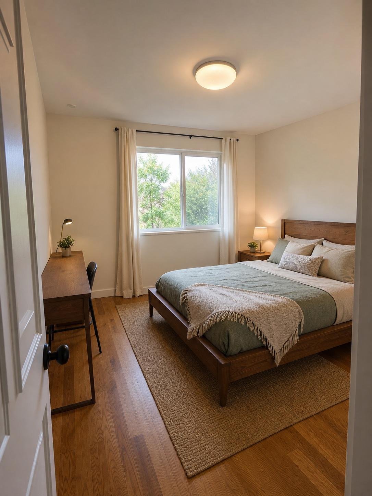

# ALIGN AI Space Analysis MVP

ALIGN is an AI-native spatial analysis product that turns a room photo and a user goal into two connected outputs:

- **Snapshot**: a concise, evidence-grounded reading with scores, tensions, and a first practical shift.
- **Full Report**: an expanded action plan that preserves the Snapshot logic instead of generating a disconnected second answer.

The repository is a production-shaped MVP built with Next.js, Gemini, Supabase, structured schemas, deterministic scoring, retrieval-backed writing, and guarded fallbacks.



## Product Flow

```mermaid
flowchart LR
    A[Room photos and user goal] --> B[Upload validation and normalization]
    B --> C[Vision pre-analysis]
    C --> D[Structured observations]
    D --> E[Deterministic scoring and diagnosis]
    E --> F[Knowledge retrieval]
    F --> G[Snapshot writer]
    G --> H[Snapshot]
    H --> I[Full report expansion]
    I --> J[Paid action plan]
```



## AI Architecture

ALIGN deliberately avoids asking one model call to own the whole result.

1. **Perception**: Gemini extracts bounded visual evidence from uploaded images.
2. **Normalization**: schema validation converts model output into versioned artifacts.
3. **Reasoning control**: deterministic builders calculate scores, priorities, contradictions, and pattern diagnosis.
4. **Retrieval**: a local knowledge layer selects room-goal rules, tension patterns, interpretation rules, and action mappings.
5. **Writing**: dedicated Snapshot and Full Report writers improve clarity without changing evidence or scores.
6. **Guardrails**: forbidden claims, unsupported inferences, length limits, URL validation, retries, and deterministic fallback paths protect output quality.
7. **Observability**: artifacts, prompt/schema versions, timings, job state, and fallback usage are persisted for debugging and evaluation.

See [docs/ARCHITECTURE.md](docs/ARCHITECTURE.md) for the detailed system map.

## MVP Capabilities

- multi-step room photo intake and personalization
- image optimization and storage validation
- asynchronous pre-analysis and snapshot generation
- structured Snapshot V2 contract
- diagnosis and retrieval-augmented writing layers
- Snapshot and Full Report continuity
- authentication, account history, and saved reports
- payment-gated report fulfillment
- waitlist, analytics, rate limits, and security event recording
- local deterministic demo fallback when external services are absent

## Technology

- Next.js App Router, React, TypeScript, Tailwind CSS
- Google Gemini via `@google/genai`
- Supabase Auth, Postgres, and Storage
- Creem billing and Resend email
- JSON-schema constrained generation and versioned artifacts

## Run Locally

```bash
npm install
cp .env.example .env.local
npm run dev
```

Open `http://localhost:3000`. The product can render its local demo path without production credentials; live AI, persistence, billing, and email require the corresponding environment variables.

## Quality Checks

```bash
npm run verify
npm audit --omit=dev
```

`npm run verify` runs the architecture boundary check, ESLint, TypeScript, and a production build.

## Environment Boundaries

- Client-safe values use the `NEXT_PUBLIC_` prefix.
- Gemini, Supabase service-role, billing, email, webhook, and admin credentials stay server-only.
- Internal operator access fails closed when `INTERNAL_ADMIN_EMAIL` is absent.
- `.env.local`, provider state, build output, local screenshots, and archives are ignored by Git.

Use [.env.example](.env.example) as the configuration inventory. Never commit real credentials.

## Repository Map

```text
src/app/                 route groups and API handlers
src/features/            product-facing feature modules
src/lib/analysis-*       pipeline orchestration and artifacts
src/lib/align-v2/        Snapshot V2 contracts and builders
src/lib/align-knowledge/ retrieval knowledge and rules
src/lib/*-writer.ts      bounded AI writing layers
src/lib/repositories/    persistence boundaries
supabase/migrations/     schema, policy, and job infrastructure
scripts/evals/vision/    repeatable vision evaluation tooling
docs/                    architecture and product decisions
```

## Security

Read [SECURITY.md](SECURITY.md) before deployment. This public portfolio version intentionally excludes development backups, credentials, personal administrator identifiers, provider-local state, and third-party prototype imagery.

## Status

This is an MVP and portfolio reference implementation. It demonstrates the complete product and AI workflow, while production operation still requires provider accounts, reviewed legal copy, monitoring, and deployment-specific security controls.
