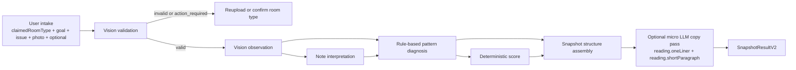

# ALIGN V2 Modular Snapshot and Full Report Templates

## Purpose

This file defines how the free snapshot and paid full report should be assembled from structured artifacts.

The key rule is:

`AI should not generate the entire report in one pass.`

Instead:

- structure is fixed
- diagnosis is fixed
- only a few language-sensitive fields may be rewritten by a small model

## Snapshot Assembly

Snapshot should be treated as a modular JSON payload, not as a single essay.

### Snapshot generation flow

### Snapshot modules

1. `validation`
2. `type`
3. `score`
4. `reading`
5. `proof`
6. `tension`
7. `firstShift`
8. `preview`

### Snapshot field mapping

| Module | Field | Source | Generation mode | Notes |
| --- | --- | --- | --- | --- |
| validation | `status/code/message/finalRoomType/roomMismatch` | `vision_observation.validation` | deterministic | Never rewrite with AI |
| type | `id/name/coreSentence/confidence` | `pattern_diagnosis.energyType` | deterministic | This is the identity layer |
| score | `goal/value/overall/label/narrative/meaning` | `score_result` | templated | Score copy should come from a fixed score-band map |
| reading | `oneLiner` | `pattern_diagnosis + note_interpretation` | micro LLM | Most emotionally important line |
| reading | `shortParagraph` | `pattern_diagnosis + score_result + note_interpretation` | micro LLM | Model can personalize tone, not diagnosis |
| proof | `proof[]` | `pattern_diagnosis.proofSignals` | deterministic | Limit snapshot to 3 proof items |
| tension | `headline` | `pattern_diagnosis.coreTension` | templated | Keep it short |
| tension | `explanation` | `pattern_diagnosis.feltImpact + score_result` | templated | Optional later polish |
| firstShift | `title/action/whyItHelps/targetZone/timing` | `pattern_diagnosis.firstShiftPattern + optional_preferences` | templated | Optional preferences can soften intensity |
| preview | `hiddenFindings/fullReportPromise` | `pattern_diagnosis.fullReportPromise` | templated | Paid curiosity layer |

### Snapshot generation split

#### Deterministic

- validation
- type
- proof selection
- preview items

#### Templated

- score narrative
- tension
- first shift

#### Small text model

- `reading.oneLiner`
- `reading.shortParagraph`

### Best MVP version

If budget is tight:

- keep `reading.oneLiner` templated too
- only add model copy later if snapshot feels too dry

## Full Report Assembly

Full report should expand the same diagnosis, not invent a second story.

### Full report modules

1. `summary`
2. `whatThisRoomIsDoing`
3. `whatIsWorking`
4. `whatIsHoldingItBack`
5. `zones`
6. `priorityShifts`
7. `timeline`
8. `optionalSupports`

### Full report field mapping

| Module | Field | Source | Generation mode | Notes |
| --- | --- | --- | --- | --- |
| summary | `typeName` | `snapshot.type` | deterministic | Keep naming continuous |
| summary | `overview` | `pattern_diagnosis + score_result + snapshot.reading` | paid LLM or templated | Can start templated |
| summary | `transformationOutcome` | `pattern_diagnosis.fullReportPromise` | templated | Should sound concrete |
| sections | `whatThisRoomIsDoing` | `pattern_diagnosis.feltImpact + vision_observation` | paid LLM or templated | Must stay evidence-bound |
| sections | `whatIsWorking` | `pattern_diagnosis.supportZone + vision_observation.supportZones` | templated | Praise before critique |
| sections | `whatIsHoldingItBack` | `pattern_diagnosis.coreTension + stressZone` | templated | Reuse snapshot language |
| zones | `zones[]` | `supportZone + stressZone + action_library` | templated | Default to 2 zones |
| priorityShifts | `priorityShifts[]` | `firstShiftPattern + action_library + optional_preferences` | templated | Order by lowest friction first |
| timeline | `tonight/thisWeek/thisMonth` | `action_library + optional_preferences + energy_type` | templated | Product path, not advice dump |
| optionalSupports | `optionalSupports[]` | `action_library + optional_preferences` | templated | Render only when additive |

## Rendering Rules

### Free layer

Free snapshot should answer:

- what kind of room state is this
- why does it feel this way
- what should I do tonight
- what else would I learn if I unlock more

It should not answer:

- the entire why
- full zone map
- complete timeline
- product suggestions

### Paid layer

Paid report should answer:

- what this room is currently doing to me
- what is already working
- what is holding it back
- which two zones matter most
- what to do tonight, this week, this month
- what optional supports are worth adding

## Caching Strategy

Because the report is modular, cache should also be modular.

Recommended cacheable artifacts:

- `vision_observation`
- `note_interpretation`
- `pattern_diagnosis`
- `score_result`
- `snapshot_structure`
- `snapshot_copy`
- `full_report_structure`
- `full_report_copy`

This allows:

- changing copy tone without re-running multimodal analysis
- A/B testing preview or reading language
- debugging exactly which layer is failing

## MVP Recommendation

The best lowest-cost production shape is:

1. `Gemini -> vision_observation`
2. `Rules -> pattern_diagnosis`
3. `Rules -> score_result`
4. `Templates -> snapshot structure`
5. `Optional small text model -> snapshot reading only`
6. `Templates -> full report structure`

This keeps the product stable while still allowing one small layer of language polish later.
