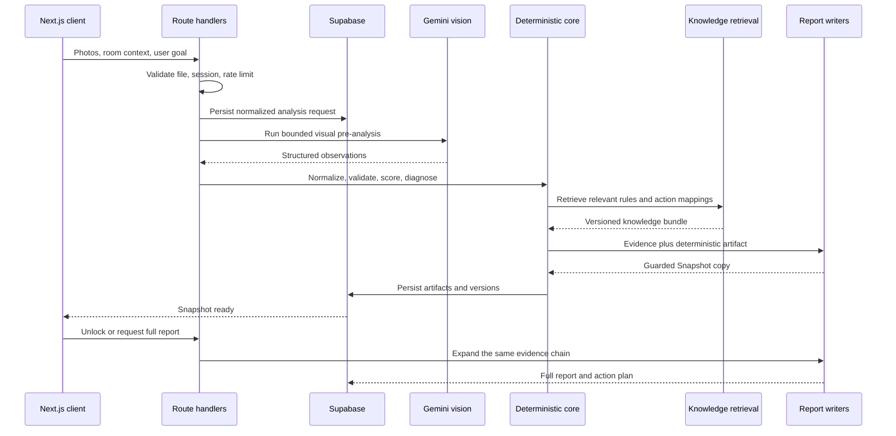

# ALIGN Architecture

## System Goal

ALIGN converts visual evidence and user intent into a reproducible spatial diagnosis. The core design principle is that models perceive and write, while deterministic code owns scoring, ranking, access control, persistence, and workflow state.

## End-to-End Workflow

## Trust Boundaries

| Layer | Responsibility | Must not own |
| --- | --- | --- |
| Vision model | Visible objects, layout, light, clutter, evidence | Final score or medical/psychological claims |
| Schema layer | Shape validation and normalized contracts | Product interpretation |
| Deterministic core | Scores, ranking, diagnosis, fallback | Invented visual evidence |
| Knowledge retrieval | Select relevant internal rules | Free-form generation |
| Writer models | Clarity, narrative, concise actions | Changing scores or adding unsupported facts |
| API and repositories | Authentication, authorization, persistence, lifecycle | Client-side secrets |

## Artifact Pipeline

The pipeline persists independently versioned artifacts so a failed writer call does not invalidate perception or scoring:

1. `normalized_input`
2. `vision_observation`
3. `note_interpretation`
4. `pattern_diagnosis`
5. `score_result`
6. `snapshot`
7. `full_report`

Each output records model, prompt, schema, scoring, and knowledge versions where applicable. This makes regression analysis and future re-generation possible.

## Snapshot and Full Report Continuity

Snapshot is the first visible layer of the report, not a separate AI answer. The Full Report inherits its evidence, scores, tension, and first-shift direction, then expands them into deeper explanation and ordered actions. Writer guardrails reject forbidden language, unsupported window/light claims, excessive length, and actions that lose their target zone.

## Failure Strategy

- invalid uploads fail before model invocation
- model output is schema-validated
- failed pre-analysis can retry through job state
- failed writer layers retain the deterministic artifact
- missing production services use a clearly marked local demo fallback
- internal admin authorization fails closed when not configured

## Runtime Boundaries

- `src/app`: HTTP and rendering entrypoints
- `src/features`: user-facing workflows
- `src/lib/analysis-*`: orchestration and artifact construction
- `src/lib/align-v2`: Snapshot contracts and deterministic builders
- `src/lib/align-knowledge`: retrieval corpus and matching
- `src/lib/repositories`: database access
- `supabase/migrations`: data model, policies, jobs, and security events

## Evaluation

Vision evaluation scripts under `scripts/evals/vision` run repeatable source images through the same pre-analysis and Snapshot layers. Results retain model and contract metadata so prompt or schema changes can be compared instead of judged from isolated screenshots.
